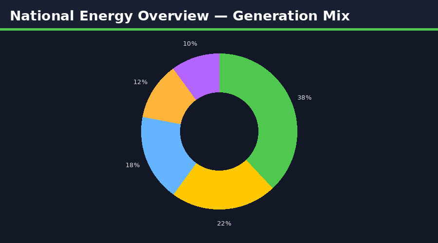

# ⚡ UK Energy Transition & Carbon Analytics


> **Comprehensive analytics project** tracking the UK's transition to net-zero: renewable energy generation, carbon emissions by sector, grid stability, and progress against Climate Change Act targets.

---

## 📊 Power BI Dashboard Preview




---

## 🎯 Project Objectives

- Track UK electricity generation mix (coal, gas, wind, solar, nuclear, hydro)
- Measure carbon emissions reduction against 2050 net-zero pathway
- Analyse renewable capacity growth and investment trends (2010–2024)
- Model grid balancing challenges as intermittent renewables scale
- Benchmark UK vs. EU and G7 nations on clean energy transition metrics

---

## 📁 Project Structure

```
uk-energy-transition/
│
├── data/
│   ├── raw/
│   │   ├── grid_generation_mix.csv       # Half-hourly Elexon/National Grid data
│   │   ├── carbon_emissions_sector.csv    # DESNZ emissions by sector
│   │   ├── renewable_capacity.csv         # Ofgem capacity by technology
│   │   ├── electricity_prices.csv         # Wholesale & retail prices
│   │   └── g7_energy_comparison.csv       # IEA international data
│   └── processed/
│       ├── daily_generation_mix.csv
│       ├── annual_carbon_pathway.csv
│       └── renewable_growth_model.csv
│
├── sql/
│   ├── 01_schema.sql
│   ├── 02_generation_mix_analysis.sql
│   ├── 03_carbon_pathway.sql
│   ├── 04_price_correlation.sql
│   └── 05_international_benchmark.sql
│
├── python/
│   ├── 01_elexon_api_pull.py             # National Grid ESO API
│   ├── 02_data_cleaning.py
│   ├── 03_eda_generation_mix.ipynb
│   ├── 04_carbon_forecasting.ipynb       # ARIMA + Prophet
│   └── 05_grid_stability_analysis.ipynb
│
├── powerbi/
│   ├── UK_Energy_Transition.pbix
│   └── theme/energy_theme.json
│
└── README.md
```

---

## 📦 Datasets Used

| Dataset | Source | Link |
|---------|--------|-------|
| UK Grid Generation Mix (half-hourly) | National Grid ESO | [🔗 Link](https://www.nationalgrideso.com/data-portal/historic-generation-mix) |
| UK Greenhouse Gas Emissions | DESNZ | [🔗 Link](https://www.gov.uk/government/collections/uk-greenhouse-gas-emissions-statistics) |
| Renewable Energy Capacity | Ofgem / DESNZ | [🔗 Link](https://www.gov.uk/government/statistics/renewable-sources-of-energy-chapter-6-digest-of-uk-energy-statistics-dukes) |
| Electricity Generation & Supply (DUKES) | DESNZ | [🔗 Link](https://www.gov.uk/government/statistics/electricity-chapter-5-digest-of-uk-energy-statistics-dukes) |
| Carbon Price (ETS & Carbon Tax) | Ember Climate | [🔗 Link](https://ember-climate.org/data/) |
| G7 Energy Transition Comparison | IEA | [🔗 Link](https://www.iea.org/data-and-statistics) |

---

## 🛠️ Tech Stack

| Tool | Purpose |
|------|---------|
| **Python** (Pandas, Matplotlib, Plotly) | EDA & visualisation |
| **Prophet / ARIMA** | Carbon emissions forecasting |
| **SQL (PostgreSQL)** | Data modelling |
| **Power BI + DAX** | Interactive dashboards |
| **National Grid ESO API** | Live generation data |

---

## 📈 Key Findings

- Renewables accounted for **42.8% of UK electricity** in 2023 — up from 6.9% in 2010
- Coal generation effectively **eliminated** (0.1% in 2023 vs. 30%+ in 2012)
- UK carbon emissions fell **46% below 1990 baseline** by 2023
- Offshore wind LCOE dropped **78%** between 2015 and 2023
- Grid curtailment of wind energy costs ~£1.2bn/year — storage investment critical
- UK on track to miss 2030 Clean Power target without 3× current offshore build rate

---

## 📌 Power BI Dashboard Pages

| Page | Description |
|------|-------------|
| **National Overview** | Generation mix donut, carbon trend, net-zero gauge |
| **Generation Mix** | Stacked area chart by fuel type, 2010–2024 |
| **Carbon Pathways** | Emissions vs. CCC pathway, sector waterfall |
| **Renewables Growth** | Capacity by technology, investment vs. output |
| **Price & Market** | Wholesale price vs. generation mix correlation |
| **International Benchmark** | UK vs. G7 on clean energy metrics |

---

## 👤 Author

**Narendra Kalisetti** | Data Analyst / BI Developer  
📧 [narendrakalisetti2000@gmail.com](mailto:narendrakalisetti2000@gmail.com) | 🔗 [LinkedIn](https://www.linkedin.com/in/narendra-kalisetti-b640271b9) | 💻 [Portfolio](https://github.com/narendrakalisetti)
